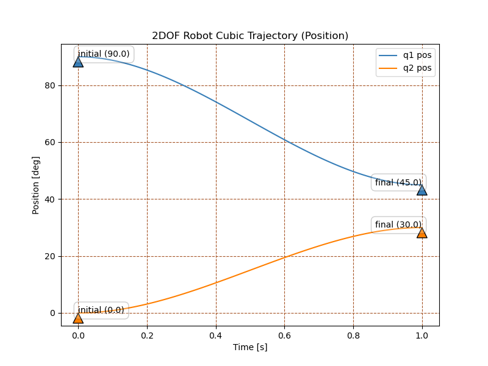
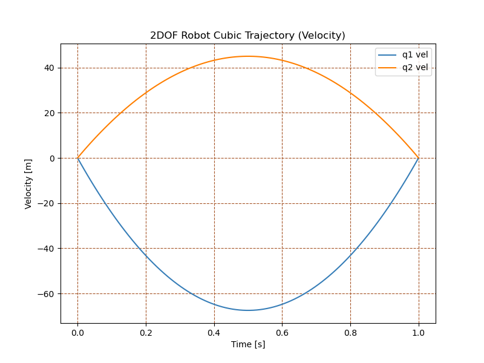
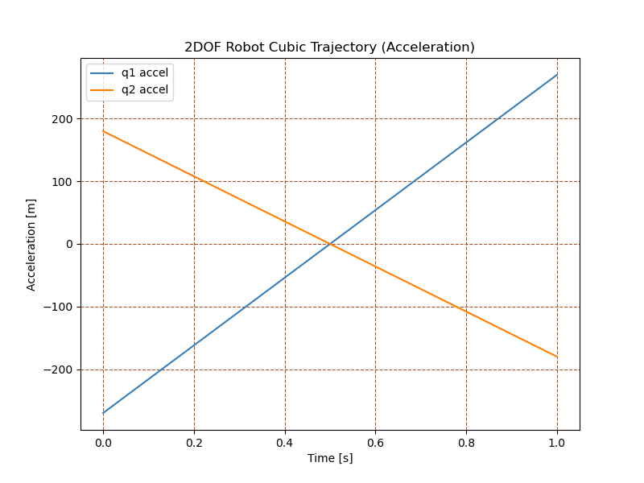

# RoboKinematics Library


<table style="border:0px">
<tr style="border:0px">
<td style="border:0px">
</td>
<td style="border:0px">

 RoboKinematics is a Python library designed to perform kinematic analysis for an n-degree-of-freedom robot manipulator. This library supports both forward and inverse kinematics, trajectory generation, Jacobian computation.
 
</td>
</tr>
</table>

<!-- <br> -->

## Features

- **Forward Kinematics**: Calculate the end-effector's position and orientation based on joint angles.
- **Inverse Kinematics**: Compute joint angles for a desired end-effector position.
- **Jacobian Computation**: Calculate the robot's Jacobian matrix for velocity and motion analysis.
- **Trajectory Generation**: Create cubic trajectories for smooth motion between joint configurations.
- **Singularity Detection**: Detect and handle singular configurations in robot kinematics.

## Installation

To install the required dependencies, you will need Python >= 3.6

To download the latest version of python, you can visit the [official python page](https://www.python.org/downloads/).


Use the following command to download the required dependencies:
```bash
pip install numpy scipy matplotlib
```

## Usage Examples

### Forward Kinematics Example

```python
from Libs.RoboKinematics import CreateKinematicModel

# Define Denavit-Hartenberg (DH) parameters for a 2-joint robot
dh_params = [
    {"frame_name": "link1", "joint_type": "r", "link_length": 1.0, "twist": 0, "offset": 0, "theta": 0},
    {"frame_name": "link2", "joint_type": "r", "link_length": 1.0, "twist": 0, "offset": 0, "theta": 0}
]

# Create the kinematic model
robot = CreateKinematicModel(dh_params, robot_name="2DOF Robot")

# Perform forward kinematics
joint_angles = [45, 30]

robot.f_kin(joint_angles)
transformation_matrices = robot.get_transforms(2, real=True)
jacobian = robot.jacobian()

print(transformation_matrices,'\n')
print(jacobian)
```
The output of the program is the transformation matrix from the base frame to the end-effector frame.
The jacobian can be computed using the jacobian(): method (function)

```python
[[ 0.25881905 -0.96592583  0.          0.96592583]
 [ 0.96592583  0.25881905  0.          1.67303261]
 [ 0.          0.          1.          0.        ]
 [ 0.          0.          0.          1.        ]] 

[[-1.67303261 -0.96593   ]
 [ 0.96592583  0.25882   ]
 [ 0.          0.        ]
 [ 0.          0.        ]
 [ 0.          0.        ]
 [ 1.          1.        ]]
```


### Inverse Kinematics Example

```python
...

# Target position of the end-effector
t = robot.SE3(robot.get_transforms(2), merge_res=True)

# Perform inverse kinematics
joint_angles = robot.i_kin(t)

print(joint_angles)
```

Output in rads: 
```python
Convergence achieved in iteration <0> : CONV error 0.000007
[0.7853981633974483, 0.5235987755982988]
```
Output in degrees:
To convert the output to deg, we use the numpy.degrees function:

```python
print(np.degrees(joint_angles))
```

```python
Convergence achieved in iteration <0> : CONV error 0.000007
[44.99997477 30.00003992]
```

### Trajectory Generation Example

```python
from Libs.RoboKinematics import CreateKinematicModel

# Define Denavit-Hartenberg (DH) parameters for a 2-joint robot
dh_params = [
    {"frame_name": "link1", "joint_type": "r", "link_length": 1.0, "twist": 0, "offset": 0, "theta": 0},
    {"frame_name": "link2", "joint_type": "r", "link_length": 1.0, "twist": 0, "offset": 0, "theta": 0}
]

# Create the kinematic model
robot = CreateKinematicModel(dh_params, robot_name="2DOF Robot")

# Perform forward kinematics
joint_angles = [90, 0]
robot.f_kin(joint_angles)

# Target position of the end-effector
target_position = [0.96592583, 1.67303261, 0, 0, 0, 1.30899694]

# Generate a trajectory from an initial to a final joint configuration
initial = robot.get_joint_states(rads=True)
final = robot.i_kin(target_position)

jt = [
       initial,
       final 
    ]

trajectory = robot.traj_gen(jt, trj_time=[1], pva=0, plot=True)
```

## Dependencies

- **NumPy**
- **SciPy**
- **Matplotlib**


## Class and Methods Overview

#### `CreateKinematicModel`

This is the main class in the library, which encapsulates all the functionalities for kinematic analysis, including forward kinematics, inverse kinematics, Jacobian calculation, and trajectory generation.

#### **Constructor: `__init__(args, robot_name, link_twist_in_rads=False, joint_lim_enable=False)`**

- **Parameters**:
  - `args`: List of Denavit-Hartenberg (DH) parameters in the form of dictionaries.
  - `robot_name`: Name of the robot (used for display purposes).
  - `link_twist_in_rads`: If `True`, treats the twist angles in radians.
  - `joint_lim_enable`: If `True`, enforces joint limits.

#### **`f_kin(qn, rads=False)`**
- **Description**: Computes the forward kinematics, i.e., the transformation matrices for each link of the robot.
- **Parameters**:
  - `qn`: A list of joint values.
  - `rads`: If `True`, angles are treated as radians; otherwise, degrees.
- **Returns**: Homogeneous transformation matrices for each joint.

#### **`i_kin(target_position, mask=[1,1,1,1,1,1], tol=1e-6, it_max=100, _damp=1e-2, euler_in_deg=False)`**
- **Description**: Computes the inverse kinematics, i.e., finds joint values for a desired end-effector position.
- **Parameters**:
  - `target_position`: The desired position and orientation of the end-effector.
  - `mask`: A mask that indicates which degrees of freedom are constrained (6D mask).
  - `tol`: Tolerance for convergence.
  - `it_max`: Maximum number of iterations.
  - `_damp`: Damping factor for numerical stability.
  - `euler_in_deg`: If `True`, Euler angles are given in degrees.
- **Returns**: Joint values that achieve the desired end-effector position.

#### **`get_transforms(stop_index=0, real=False)`**
- **Description**: Computes the full transformation matrix for the robot up to the `stop_index` joint.
- **Parameters**:
  - `stop_index`: Specifies up to which joint the transformation should be calculated.
  - `real`: If `True`, enables real-number precision printing.
- **Returns**: The transformation matrix at the specified joint.

#### **`jacobian()`**
- **Description**: Calculates the robot's Jacobian matrix, which relates the joint velocities to the end-effector velocities.
- **Returns**: The Jacobian matrix as a NumPy array.

#### **`singular_configs_check()`**
- **Description**: Checks for singular configurations, where the robot's Jacobian matrix loses rank, indicating potential issues in control.
- **Returns**: Prints whether a singularity is found.

#### **`get_num_of_joints()`**
- **Description**: Returns the number of joints in the robot model.
- **Returns**: Integer representing the number of joints.

#### **`traj_gen(tr_lst, trj_time, pva, plot=False)`**

#### **Description**:
The `traj_gen()` method generates a complete trajectory between multiple waypoints (positions) over a specified time for each segment. It allows you to define cubic trajectories for position, velocity, or acceleration, and optionally plot the results.

#### **Parameters**:
- **`tr_lst`**: A list of waypoints, where each waypoint is a list of joint positions. For example, `[[0, 45, 90], [90, 45, 0]]` represents two waypoints for a 3-joint robot.
- **`trj_time`**: A list of time intervals for each segment of the trajectory. For example, `[1, 2]` specifies that it will take 1 second to move from the first waypoint to the second, and 2 seconds to move from the second to the third.
- **`pva`**: A flag indicating whether to generate a trajectory for **position** (`pva = 0`), **velocity** (`pva = 1`), or **acceleration** (`pva = 2`).
- **`plot`**: A boolean (`True/False`). If `True`, the generated trajectory is plotted.

#### **Returns**:
- **`trajectory`**: A list of generated trajectories for each joint over time. Each element in the list corresponds to a segment of the full trajectory between two waypoints.

#### **Usage Example**:

```python
# Define waypoints (joint configurations) and corresponding time intervals
way_points  = [
    [3.60000000e-01, -2.44929360e-18,  8.50000000e-02, 3.14159265e+00,  0.00000000e+00,  0.00000000e+00],
    [2.20000000e-01,  6.12323400e-18,  2.25000000e-01, 3.14159265e+00,  0.00000000e+00, -5.23598776e-01],
    [0.16,   0.24248711,  0.21624356,-2.15879893, -0.4478324,  -1.8133602],
    [2.20000000e-01,  6.12323400e-18,  2.25000000e-01, 3.14159265e+00,  0.00000000e+00, -5.23598776e-01],
]

# Generate a cubic trajectory for position (pva=0) and plot the results
time_intervals = [1, 2, 3]  # time to move between each pair of waypoints

robot = CreateKinematicModel(dh_params, robot_name="6DOF Robot")

robot.f_kin([0, 0, 0, 0, 0, 0])

q = [robot.i_kin(way_point, it_max=100) for way_point way_points]     

trajectory = robot.traj_gen(q, time_intervals, 0, plot=True)
```

#### **Notes**:
- You can use `traj_gen()` to generate and visualize complex multi-segment trajectories for a robot with multiple joints.
- The `pva` parameter allows you to specify whether you want the trajectory for position, velocity, or acceleration.
- **Example Plot**: The method can plot cubic trajectories showing the robot joint positions (or velocities/accelerations) over time for each segment.

<!-- 


 -->

<table style="border:0px">
<tr style="border:0px">
<td style="border:0px">

</td>
<td style="border:0px">
</td>
</td>
<td style="border:0px">

</td>
</tr>
</table>

## License

This project is licensed under the Apache License, Version 2.0 - see the [LICENSE](http://www.apache.org/licenses/LICENSE-2.0) file for details.

## Contributing

Contributions are welcome! Please open an issue or submit a pull request on [GitHub](https://github.com/Silas-U/Robot-Kinematics-lib/tree/main).

## Author

**Silas Udofia (Silas-U)**


